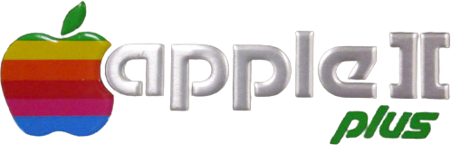

*https://logos.fandom.com/wiki/Apple_II_Plus*

# Code Surfer Dev - Apple II+ Documented

I purchased an Apple II plus on ebay back in January of 2022. The computer
collected dust on my "Retro Computing Hall of Fame" display shelf until December
2023, which was when I purchased an Apple disk II floppy drive on ebay. Having
the floppy drive has lite a fire under my butt to dig into this iconic personal
computer, and this document repo is a compilation of my own personal notes on
the internals and how everything works.

Much has been taken from archived books and manuals, blogs, and other sources. I
will link sources wherever possible.

# 6502 Microprocessor

The _Apple II plus_ microcomputer uses a 6502 microprocessor as it's **Central
Processing Unit (CPU)**.
